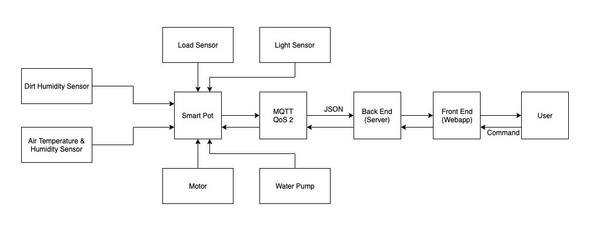

# Embedded System Coursework 1 (Group HexFuture)

## Overall Architecture for HexPot (Smart Pot for Plant)



## Explanation for code

```bash
HexLibrary_final.py
```
This file is a library that contains implementation for accessing low-level sensors

```bash
Main_final.py
```
This file is contains code that runs the functions within HexLibrary_final.py and package the data from sensors into JSON format

```bash
MQTT_final.py
```
This file is used for encryption communication with backend server through MQTT protocol. It will be called multiple times as long as the embedded system is running.


## To use

```bash
python3 MQTT_final.py
```